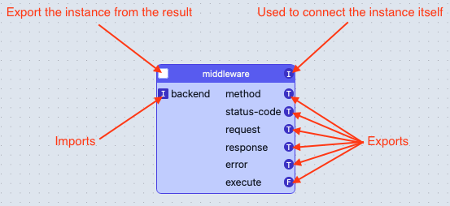
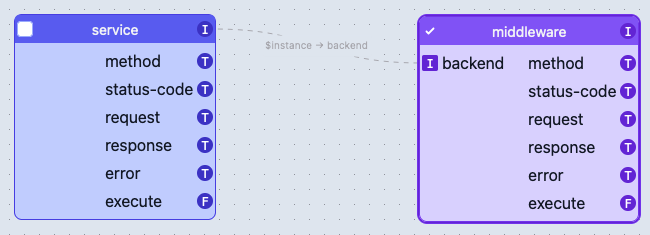

# WebAssembly Component Builder

## Overview

This project is a simple GUI tool for building [WebAssembly components](https://github.com/WebAssembly/component-model)
from other WebAssembly components.

## Getting Started

### Prerequisites

To build this project, the following tools must be installed locally:

- [The latest stable Rust toolchain](https://www.rust-lang.org/tools/install)
- [Yarn](https://yarnpkg.com/getting-started/install)
- [Make](https://www.gnu.org/software/make/)

### Setup

To install the dependencies of the project, run the following command:

```sh
$ make setup
```

This will also install the `wit-bindgen` and `cargo component` command line tools
(if not already installed).

### Running Locally

To run the application locally, run the following command:

```sh
$ make run
```

By default, the application runs on port 3000. Open a Web browser and navigate to
`http://localhost:3000` to view the application.

## Application Details

The application is a single-page [React](https://reactjs.org/) application that is bundled
with [Parcel](https://parceljs.org/).

It uses a small Rust library, compiled to a WebAssembly module, that is responsible for parsing
WebAssembly component files and maintaining the composition graph state.

The React application maintains the state of the user interface and ensures that the internal
graph state is kept in sync with the visual representation of the graph.

The application's user interface was developed by someone who is not a designer (or even possessing
rudimentary front-end development skills). It is not pretty, but it works™. Pull requests to improve
the interface are most welcome!

## Using the Application

### Building Components

Currently the easiest way to build individual WebAssembly components is to use Rust and
[cargo-component](https://github.com/bytecodealliance/cargo-component).

In the future, many more programming languages will be supported and since WebAssembly components
are themselves language-agnostic, they will be able to be used by this application.

### Adding Components

Initially the application will have no WebAssembly components in the component library.

Click the `Add Component` button to add a new component to the library and select the desired
WebAssembly component (`.wasm`) file.

Alternatively, a WebAssembly component textual-representation file (`.wat`) can be added to the
library.

To view details about a component, click on the component in the library.

### Instantiating Components

To instantiate a component, drag the component from the library to the design surface.

This will create an instance of the component that can be connected to other instances in the graph.

### Anatomy of an Instance

Each instance of a component has a set of imports and exports. Exports and imports can be connected
by dragging a connection between the circles and squares that represent them.

An example instance:



In this example, the instance of the `middleware` component imports an instance named `backend` and
exports five types and a function named `execute`.

The circle `I` in the upper right corner represents the instance itself and can be used to connect
with an import on another instance that takes a matching instance import.

Finally, the checkbox in the upper left corner can be used to export the instance (see below).

### Connecting Instances

To connect two instances, drag a connection from the circle of an export on one instance to the
square of a matching import on another instance.

The names do not need to match, but the types of the items must be compatible with one another.

Connecting an instance forms a dependency relationship between the two instances: the exporting
instance is guaranteed to be instantiated before the importing instance.

An example connection:



In this example, an instance of the `service` component is connected to the `backend` import of
an instance of the `middleware` component.

When a component is created for this graph, the `service` instance will be instantiated before
the `middleware` instance, which will receive the `service` instance for the `backend`
instantiation argument.

### Exporting an Instance

Currently a single instance in the graph may be designated as the instance to export.

All exports on that designated instance will be directly exported from the resulting component.

To designate an instance to export, click the checkbox in the upper left corner of the instance.

If no instance is checked, the resulting component will not have any exports.

### Downloading the Component

To download the component that represents the current state of the graph, click the
`Download Component` button.

Give the component a name and click the `Download` button; the new component `.wasm` file will be
downloaded by your browser.

If the `define component dependencies` checkbox remains checked, any components referenced in the
graph will be embedded in the resulting component; uncheck the checkbox to import the components
instead (note: [Wasmtime](https://wasmtime.dev) does not support importing components currently).

By default, the resulting component will also be added to the component library of the application
and can be dragged from the library to the design surface to create a new instance.
